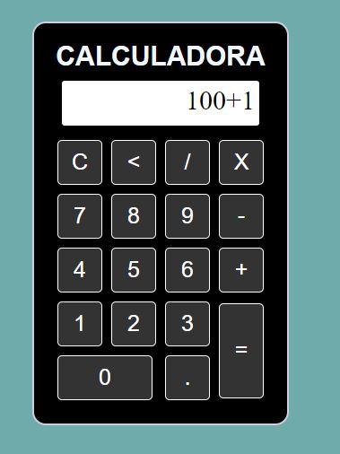

# Calculadora-JS-HTML-CSS


<p align="center">
  
</p>

# Sobre o Projeto

#### 

Projetos de apredizado, utilizando tecnologias Front End.
Tem como objetivo praticar linguagem JavaScript, HTML e CSS.

<h4>
  
## Link do projeto

#### https://calculadora-javascript-ol8.netlify.app

# Tecnologias utilizadas
  
## Front end
- Javascript 
- CSS
- HTML
  
## Implementação em produção
- Front end web: Netlify
  
# Como executar o projeto

## Front end
Pré-requisitos: npm / yarn

```bash
# clonar repositório
  
git clone https://github.com/OseiasLissak/Calculadora-JS-HTML-CSS.git

# entrar na pasta do projeto Calculadora-JS-HTML-CSS
cd Calculadora-JS-HTML-CSS


# instalar dependências
yarn install

# executar o projeto
yarn start
```  
  
# Autor
  
Oseias Lissak dos Santos
  
www.linkedin.com/in/oseiaslissak

